# Claude Command Runner

<div align="center">
  
</div>

**Lets Claude actually use your terminal.** You ask, Claude types the command into your [Warp](https://app.warp.dev/referral/G9W3EY) tab, captures the output, and tells you what happened. It's a Model Context Protocol (MCP) server with 39 tools — command execution, project setups, file watching, SSH, clipboard, environment intelligence — and the same binary works from both Claude Desktop and Warp's built-in AI agent panel. macOS, Swift, open source.

> Built for [Warp Terminal](https://app.warp.dev/referral/G9W3EY) (free, open source AGPL-3.0). The 5 most powerful tools route commands visibly into your active Warp tab — that's the magic of this MCP. If you don't use Warp yet, [grab it here](https://app.warp.dev/referral/G9W3EY) — it pairs with this MCP for what's probably the closest thing to "Claude with a real terminal" you can get right now.

## 🚀 What's New in v6.0.0 — Warp re-pivot

**Triggered by Warp going open source** under AGPL-3.0 ([github.com/warpdotdev/warp](https://github.com/warpdotdev/warp)) in May 2026. v6.0 re-establishes Warp as the primary integration target and adds a new install path: **Warp's native agent panel**.

- **Dual-consumer architecture**: register `claude-command-runner` in `~/.warp/.mcp.json` and Warp's built-in agent (which uses your configured LLM — Claude Sonnet, Opus, etc.) calls the same tools Claude Desktop calls. Same binary, same code, two consumers. See [`docs/WARP_AGENT.md`](docs/WARP_AGENT.md).
- **Deeplinks replace AppleScript** for tab/window operations: `open_terminal_tab` now uses `warp://action/new_tab?path=...`. No menu-clicking, no Accessibility permission for the open path.
- **OSC 777 emitter** (`emit_warp_event`): build `printf` invocations that surface structured events into Warp's notification UI. Schema reimplemented from upstream `event/v1.rs` (no vendoring).
- **Workspace profiles → Warp launch configs**: `save_workspace_profile` accepts `include_warp_launch_config: true` to also write a YAML to `~/.warp/launch_configurations/`, making the profile appear in Warp's launch UI.
- **Optional shell shim** (Tier E, opt-in): `helper/install-shim.sh` adds zsh/bash hooks that emit preexec/command_finished events to a per-uid Unix socket the MCP listens on. Auto-disables outside Warp panes. Observability surface in v6.0; auto-routing `execute_command` through it is deferred to v6.0.x.
- **Cleanup**: ~460 LOC of dead code removed (obsolete Warp DB integration, orphan TCP listener, unreachable background monitor). Tool count corrected: README claimed 30, reality was 36, v6.0 ships 39.
- **Reproducible build**: swift-sdk pinned to `0.10.x` with a deterministic `scripts/patch-swift-sdk.sh` so a fresh clone builds without manual patches.

> **Honest caveat:** the "Claude" replying in Warp's agent panel is *Warp's* agent (running whichever LLM you configure in Warp's AI settings), not your Claude Desktop instance. Both can call the MCP; they don't share conversations. v6.0 does not bridge them.

## What's New in v5.0.0 (history)

**v5.0.0: 36 tools, up from 12.**

- **Clipboard Bridge**: Read from and write to the macOS clipboard without leaving the conversation
- **macOS Notifications**: Get native notifications when long-running commands finish
- **Environment Intelligence**: Probe your terminal context (git branch, active venv, Node version, Docker containers) in one call
- **Output Parsers**: Structured JSON parsing for `git status`, `docker ps`, test results, and more
- **Environment Snapshots**: Capture and diff environment variables before/after installs or config changes
- **Workspace Profiles**: Save and restore project contexts (directory, env vars, common commands) per project
- **Multi-Terminal Sessions**: Open, name, and send commands to multiple terminal tabs
- **Interactive Command Detection**: Smart detection of interactive commands (vim, ssh, python REPL) with graceful handling
- **File System Watchers**: Watch directories for changes and trigger commands automatically
- **SSH Remote Execution**: Run commands on remote hosts via SSH key authentication

### Previous Releases (Included)

- **v4.0**: Command pipelines, output streaming, reusable templates
- **v3.0**: Smart auto-retrieve, SQLite history, configurable security

## Overview

Claude Command Runner is a **dual-consumer MCP server** — the same binary serves Claude Desktop **and** Warp's native agent panel. It enables an LLM (whichever you've configured in either client) to:

- Execute terminal commands directly from conversations
- Chain commands with conditional logic using pipelines
- Stream output in real-time for long builds
- Save and reuse command templates with variables
- Automatically capture output with intelligent timing
- Track command history and patterns
- Read/write the macOS clipboard
- Probe environment context (git, venv, Docker, Node)
- Parse command output into structured JSON
- Manage workspace profiles per project (with optional emission as Warp launch configs)
- Open terminal tabs (via `warp://` deeplinks; AppleScript fallback for non-Warp terminals) and send commands to the active tab
- Watch files and trigger commands on changes
- Execute commands on remote hosts via SSH
- **(v6.0)** Surface tool-execution status to Warp's UI as OSC 777 `warp://cli-agent` events
- **(v6.0, opt-in)** Stream clean preexec / command-finished events from your shell to the MCP via a per-uid Unix domain socket

## 🧭 Which Claude product does this work with?

`claude-command-runner` is an MCP server, so any Anthropic surface that consumes MCP servers can call its 39 tools — but the **value-add varies sharply by consumer**, and you should pick deliberately.

| Consumer | Where to register | Value-add | Recommended? |
|---|---|---|---|
| **Claude Desktop** | `~/Library/Application Support/Claude/claude_desktop_config.json` | **High.** `execute_command` types into your Warp tab so terminal action is *visible* alongside the chat. Chat stays focused on reasoning; the terminal becomes the work surface. | ✅ Primary use case |
| **Cowork** (inside Claude Desktop) | Same config as Claude Desktop | **High.** Same model — your collaborators see the chat; commands run in your Warp pane. | ✅ Yes |
| **Warp's native agent panel** | `~/.warp/.mcp.json` (see [docs/WARP_AGENT.md](docs/WARP_AGENT.md)) | **High.** Type into Warp's agent panel, agent calls our tools, output renders inline in Warp's chat. Same MCP, same code, second consumer. | ✅ Yes — see WARP_AGENT.md |
| **Claude Code (CLI)** | `~/.claude.json` | **Marginal — only if you want commands in a *different* Warp tab from the one Claude Code is in.** Claude Code already runs *inside* a terminal pane (Warp or otherwise) and has its own built-in `Bash` tool that spawns subprocesses with pipes. For routine command execution Claude Code's built-in is shorter, faster, and doesn't need TCC permissions. The MCP is only worth registering if you want commands to land *visibly in a separate Warp tab* you control — e.g. as a "scratch" pane you can scroll through later. | ⚠️ Optional, niche |
| **Other terminals (iTerm2, Terminal.app, Alacritty)** | Any of the above | **Low.** Most of v6.0's value is Warp-specific: `warp://` deeplinks, OSC 777 events, Warp agent integration, launch configs. The 24 server-side tools (clipboard, SSH, env snapshots, file watcher, etc.) work everywhere — but at that point you're using maybe two-thirds of the surface area. | ❌ Look elsewhere |

### Quick decision tree

- **You use Warp + Claude Desktop and want commands visible in your terminal?** → Register here. Primary use case.
- **You use Warp + Claude Code and want everything in one pane?** → Don't bother. Claude Code's built-in `Bash` tool is enough.
- **You use Warp + Claude Code and want commands in a *separate* observable Warp tab?** → Register and use `execute_command` deliberately.
- **You use Warp's native agent panel?** → Register in `~/.warp/.mcp.json`.
- **You don't use Warp?** → This isn't the right MCP for you. Look at simpler subprocess-based MCPs.

The "39 tools" headline is honest but slightly misleading: 5 of those tools (the AppleScript-keystroke ones — `execute_command`, `execute_with_auto_retrieve`, `execute_with_streaming`, `run_template`, `send_to_session`) are the Warp-routing crown jewels, and 24 of them are pure server-side utilities that any subprocess-based MCP could provide. The remaining 10 sit in between (deeplinks, OSC 777, profiles, file watchers). If the Warp-routing 5 don't appeal, the rest of this MCP is fine but unremarkable.

## 🎯 Key Features

### Command Pipelines
Chain multiple commands with intelligent failure handling:

```json
{
  "steps": [
    {"name": "Build", "command": "swift build", "on_fail": "stop"},
    {"name": "Test", "command": "swift test", "on_fail": "continue"},
    {"name": "Package", "command": "swift build -c release", "on_fail": "stop"}
  ]
}
```

**Failure modes:**
- `stop` – Halt pipeline on failure
- `continue` – Log error and proceed to next step
- `warn` – Show warning and continue

### Output Streaming
Real-time output for long-running commands:

```json
{
  "command": "swift build -c release",
  "update_interval": 3,
  "max_duration": 180
}
```

Perfect for:
- Long compilation processes
- Test suites
- Any command that previously "hung" waiting for output

### Command Templates
Save reusable patterns with variable substitution:

```json
// Save a template
{
  "name": "swift-release",
  "template": "cd {{project}} && swift build -c release",
  "category": "Swift Development",
  "description": "Build Swift project in release mode"
}

// Run with variables
{
  "name": "swift-release",
  "variables": {"project": "~/GitHub/MyApp"}
}
```

Templates are stored in `~/.claude-command-runner/templates.json` and persist across sessions.

### Smart Auto-Retrieve
The `execute_with_auto_retrieve` command intelligently detects command types and adjusts wait times:
- **Quick commands** (echo, pwd): 2-6 seconds
- **Moderate commands** (git, npm): up to 20 seconds  
- **Build commands** (swift build, make): up to 77 seconds
- **Test commands**: up to 40 seconds

## 📊 Why Warp Terminal?

[Warp Terminal](https://app.warp.dev/referral/G9W3EY) is the primary integration target. The other terminals work for the basics — what Warp uniquely unlocks in v6.0 is documented integration surfaces:

| Feature | Warp | Terminal.app | iTerm2 |
|---------|------|--------------|---------|
| `warp://` deeplinks for tab/window | ✅ (v6.0 uses these) | ❌ | ❌ |
| Native MCP agent panel — chat with Claude *in* the terminal | ✅ (`~/.warp/.mcp.json`) | ❌ | ❌ |
| OSC 777 cli-agent event channel for status surfacing | ✅ | ❌ | ❌ |
| Workspace profile → recognized launch config | ✅ (`~/.warp/launch_configurations/`) | ❌ | ❌ |
| AppleScript-driven new tab + keystroke send | ✅ | ✅ | ✅ |
| Modern UI/UX | ✅ | ⚠️ | ⚠️ |

Output capture (`/tmp/<id>.json` polling) and the 24 tools that don't touch the terminal at all (clipboard, SSH, file watch, env snapshots, etc.) work identically across all terminals.

> 💡 **Get Warp**: [Download Warp Terminal](https://app.warp.dev/referral/G9W3EY) – it's free, open source (AGPL-3.0), and makes the v6.0-specific surfaces above available to you.

## Installation

### Prerequisites
- macOS 13.0 or later
- Swift 6.0+ (Xcode 16+)
- Claude Desktop
- A supported terminal ([Warp](https://app.warp.dev/referral/G9W3EY) strongly recommended)

### Quick Install

1. Clone and build:
```bash
git clone https://github.com/M-Pineapple/claude-command-runner.git
cd claude-command-runner
./build.sh
```

2. **Pick your consumer(s)** — you can install for one or both. **v6.0.3 ships a `.app` bundle wrapper** — point at the binary INSIDE the bundle (the wrapper carries the Info.plist that macOS Sequoia+ needs to prompt for TCC permissions; without it, the 5 keystroke-routing tools silently fail):

   **A — Claude Desktop** (`~/Library/Application Support/Claude/claude_desktop_config.json`):
   ```json
   {
     "mcpServers": {
       "claude-command-runner": {
         "command": "/path/to/claude-command-runner/.build/release/claude-command-runner.app/Contents/MacOS/claude-command-runner",
         "args": []
       }
     }
   }
   ```

   **B — Warp's native agent** (`~/.warp/.mcp.json`):
   ```json
   {
     "mcpServers": {
       "claude-command-runner": {
         "command": "/path/to/claude-command-runner/.build/release/claude-command-runner.app/Contents/MacOS/claude-command-runner",
         "args": []
       }
     }
   }
   ```
   See [`docs/WARP_AGENT.md`](docs/WARP_AGENT.md) for the full guide.

   > **Upgrading from v6.0.0–6.0.2?** Edit your existing config file and append `.app/Contents/MacOS/claude-command-runner` to the path. The legacy bare-binary path still works for the 34 non-keystroke tools, but `execute_command` / `execute_with_auto_retrieve` / `execute_with_streaming` / `run_template` / `send_to_session` will silently fail without the bundle path.

3. **Grant Accessibility permission** (only required for `send_to_session` keystroke injection in v6.0; tab/window opening uses deeplinks and does not require it):
   - Open **System Settings → Privacy & Security → Accessibility**
   - Click **+** and navigate to `claude-command-runner/.build/release/`
   - Press **Cmd+Shift+.** to reveal the hidden `.build` folder
   - Select the `claude-command-runner` binary and toggle it **on**

> **Important:** macOS tracks permissions by binary identity. After every rebuild (`./build.sh`), you must remove the old entry and re-add the new binary in Accessibility settings.

4. **Restart your client(s)** (Claude Desktop and/or Warp).

5. **(Optional)** Install the shell shim for cleaner block-boundary capture:
   ```bash
   helper/install-shim.sh
   ```
   See `helper/shell-shim.zsh` / `helper/shell-shim.bash` for the implementation. Uninstall with `helper/uninstall-shim.sh`.

### 🛡️ macOS Sequoia full setup recipe (the 7 ordered steps)

> If `execute_command` / `execute_with_auto_retrieve` / `execute_with_streaming` / `run_template` / `send_to_session` fail with `osascript is not allowed to send keystrokes (1002)` even though you've toggled every panel in System Settings, **follow this in order — skipping any step leaves a silent denial somewhere in the chain.** The other 34 tools work without any of this; `execute_pipeline` is a fully-functional substitute if you want to skip the whole TCC saga entirely.
>
> This is the empirically-verified recipe from a real 6-hour debugging session. v6.0.3+ ships the bundle infrastructure that makes this possible; v6.0.4 is this documentation pass.

**The denial pattern.** macOS Sequoia's TCC and sandbox have layered, *non-obvious* requirements for CLI binaries that drive `osascript → System Events → keystroke`. The error message is misleading — the actual block usually isn't keystroke permission; it's an earlier preflight check that silently aborts the chain. The five gates, in the order macOS evaluates them:

| Gate | TCC service | What grants it |
|---|---|---|
| 1. Bundle promptability | (n/a — policy) | Bundle in `/Applications/`, not `.build/release/` |
| 2. Bundle identity stable | (n/a — codesign) | Signed with a stable cert (cdhash doesn't drift across rebuilds) |
| 3. Sandbox FDA preflight | `kTCCServiceSystemPolicyAllFiles` | Full Disk Access grant on the bundle |
| 4. AppleEvents | `kTCCServiceAppleEvents` | Automation → System Events ☑ |
| 5. Keystroke synthesis | `kTCCServiceListenEvent` / `kTCCServicePostEvent` | Input Monitoring + Accessibility |

#### Step 1 — Have an Apple Development cert (or self-signed Code Signing cert)

If you have a paid Apple Developer account, you already have one (check via `security find-identity -v -p codesigning`). If not, create a self-signed one:

1. **Keychain Access** → menu **Certificate Assistant → Create a Certificate…**
2. Name: `claude-command-runner`, Identity Type: **Self Signed Root**, Certificate Type: **Code Signing**
3. Click **Create** → **Continue** through warnings → **Done**

Export the cert identifier for `build.sh` to find:
```bash
# Get the SHA-1 hash (more reliable than the cert name)
security find-identity -v -p codesigning
# Then in your shell rc (~/.zshrc, ~/.config/fish/config.fish, etc.):
export CCR_CODESIGN_IDENTITY="<the-sha1-hash-from-above>"
```

#### Step 2 — Build (creates the signed `.app` bundle)

```bash
./build.sh
```

`build.sh` invokes `scripts/make-app-bundle.sh`, which wraps the CLI in `.build/release/claude-command-runner.app/` with a proper `Info.plist` (CFBundleIdentifier `com.m-pineapple.claude-command-runner`, the three required `NSXxxUsageDescription` strings, LSUIElement=true). If `CCR_CODESIGN_IDENTITY` is set, the bundle is signed with that cert as a unit — stable cdhash across rebuilds.

**Verify:**
```bash
codesign --display --verbose=4 .build/release/claude-command-runner.app | grep -E 'Identifier|TeamIdentifier|CDHash'
codesign --verify --deep --strict .build/release/claude-command-runner.app  # should succeed silently
```

#### Step 3 — Install the bundle into `/Applications/` (CRITICAL)

**macOS refuses to prompt for TCC permissions on bundles in `.build/release/` or other dev directories.** The bundle must live in `/Applications/`. Copy it:

```bash
cp -R .build/release/claude-command-runner.app "/Applications/Claude Command Runner.app"
```

Verify the signature survived the copy:
```bash
codesign --verify --deep --strict "/Applications/Claude Command Runner.app"
```

#### Step 4 — Point your MCP config at the `/Applications/` path

**Claude Desktop** (`~/Library/Application Support/Claude/claude_desktop_config.json`):
```json
{
  "mcpServers": {
    "claude-command-runner": {
      "command": "/Applications/Claude Command Runner.app/Contents/MacOS/claude-command-runner",
      "args": []
    }
  }
}
```

Mirror in `~/.warp/.mcp.json` if you use the Warp Agent path.

#### Step 5 — Reset stale TCC entries for the bundle ID

If you've been struggling with TCC denials previously, your TCC.db likely has stale `Denied` entries from earlier rebuilds with different cdhashes. Wipe them for the bundle:

```bash
for svc in AppleEvents ListenEvent PostEvent Accessibility; do
    tccutil reset "$svc" com.m-pineapple.claude-command-runner
done
```

Each line should print "Successfully reset". If you see "no entries", that's also fine — means TCC had nothing recorded yet.

#### Step 6 — Grant the *three* TCC permissions (Full Disk Access is the surprise one)

In **System Settings → Privacy & Security**, add `/Applications/Claude Command Runner.app` to each of:

1. **Full Disk Access** — *unexpected but mandatory.* macOS sandbox does a preflight check for `kTCCServiceSystemPolicyAllFiles` before allowing osascript to spawn for keystroke chains. Without FDA on the bundle, the sandbox denies before TCC's AppleEvents check ever fires, and you get the misleading "send keystrokes" error.
2. **Input Monitoring** — for `kTCCServiceListenEvent` / `kTCCServicePostEvent` (synthetic keystroke generation).
3. **Accessibility** — for the `keystroke` AppleEvent action itself.

Each grant requires Touch ID / admin password to confirm. **Bundle name appears as "Claude Command Runner"** in the panels.

#### Step 7 — Restart Claude Desktop, trigger once, grant the Automation prompt

`⌘Q` Claude Desktop, reopen. On your first `execute_command`, macOS may show one more prompt — **Automation → "Claude Command Runner wants to control System Events"** — click Allow. After that, it's permanent. Future rebuilds don't reset anything (the cert keeps cdhash stable; the bundle keeps the identity stable).

---

### Diagnostic: what does TCC see right now?

If something doesn't work after the recipe, the only reliable way to figure out which gate is failing is the TCC log:

```bash
log show --predicate 'process == "tccd"' --last 30s --info --debug \
    | grep -E 'AUTHREQ_CTX|AUTHREQ_RESULT|m-pineapple|promptPolicy|Service Policy'
```

Trigger an `execute_command` first, then immediately run the above. Read it for:
- `service="kTCCServiceXxx"` — which permission category is being checked
- `promptPolicy = 0` → macOS refuses to even prompt; usually a location problem (bundle not in `/Applications/`)
- `promptPolicy = 2` + `Denied (Service Policy)` → you're missing the permission for the named service
- `AttributionChain: responsible={identifier=com.m-pineapple.claude-command-runner, ...}` → good, TCC is identifying us correctly

### If you really can't get it working

`execute_pipeline` is a fully-functional substitute for `execute_command`:

```jsonc
// instead of execute_command: {"command": "git status"}
// use:
{"steps": [{"command": "git status"}]}
```

Pure subprocess, no AppleScript, no TCC layer, captures output cleanly, works on any macOS version regardless of permissions. The visible side-effect (command appearing in your Warp tab) is the only thing you lose — for most agent workflows that's not what you actually need anyway.

---

## Usage

### Available Tools (39)

#### Core Execution

| Tool | Description | Use Case |
|------|-------------|----------|
| `execute_command` | Execute with manual output retrieval | Simple commands |
| `execute_with_auto_retrieve` | Execute with intelligent auto-retrieval | Most common usage ⭐ |
| `execute_pipeline` | Chain commands with conditional logic | Build workflows, CI/CD |
| `execute_with_streaming` | Real-time output streaming | Long builds, test suites |
| `save_template` | Save reusable command pattern | Create shortcuts |
| `run_template` | Execute saved template with variables | Run saved patterns |
| `list_templates` | View all saved templates | Manage templates |
| `get_command_output` | Manually retrieve command output | Debugging |
| `preview_command` | Preview without executing | Safety check |
| `suggest_command` | Get command suggestions | Discovery |
| `list_recent_commands` | View command history | Analytics |
| `self_check` | System health diagnostics | Troubleshooting |

#### Clipboard (v5.0)

| Tool | Description | Use Case |
|------|-------------|----------|
| `copy_to_clipboard` | Write text to macOS clipboard | Share output |
| `read_from_clipboard` | Read current clipboard content | Paste context |

#### Notifications (v5.0)

| Tool | Description | Use Case |
|------|-------------|----------|
| `set_notification_preference` | Toggle macOS notifications | Personalisation |

#### Environment Intelligence (v5.0)

| Tool | Description | Use Case |
|------|-------------|----------|
| `get_environment_context` | Probe git, venv, Node, Docker state | Context awareness |
| `execute_and_parse` | Execute and parse output to structured JSON | Smart output |
| `capture_environment` | Snapshot all environment variables | Before/after comparison |
| `diff_environment` | Compare two environment snapshots | Change detection |

#### Workspace Profiles (v5.0)

| Tool | Description | Use Case |
|------|-------------|----------|
| `save_workspace_profile` | Save project context as named profile | Project switching |
| `load_workspace_profile` | Restore a saved project context | Resume work |
| `list_workspace_profiles` | View all saved profiles | Organisation |
| `delete_workspace_profile` | Remove a workspace profile | Cleanup |

#### Multi-Terminal Sessions (v5.0)

| Tool | Description | Use Case |
|------|-------------|----------|
| `open_terminal_tab` | Open a new named terminal tab (Warp: via `warp://action/new_tab` deeplink in v6.0) | Long-running processes |
| `send_to_session` | Send command to a specific tab (AppleScript keystroke; tab-targeting limited on Warp) | Targeted execution |
| `list_sessions` | View active terminal sessions | Session overview |
| `close_session` | Close a named session | Cleanup |
| `cleanup_sessions` | Bulk-remove stale sessions; optionally close their tabs | Hygiene |

#### Interactive Command Detection (v5.0)

| Tool | Description | Use Case |
|------|-------------|----------|
| `check_interactive` | Classify a command for TTY/stdin requirements before running it | Avoid hangs from `vim`, `ssh`, `psql`, REPLs |

#### File Watching (v5.0)

| Tool | Description | Use Case |
|------|-------------|----------|
| `add_file_watch` | Watch directory and trigger command on changes | Auto-rebuild, auto-test |
| `remove_file_watch` | Stop watching a directory | Cleanup |
| `list_file_watches` | View active watchers | Overview |

#### SSH Remote Execution (v5.0)

| Tool | Description | Use Case |
|------|-------------|----------|
| `ssh_execute` | Run command on remote host via SSH | Remote ops |
| `save_ssh_profile` | Save SSH connection profile | Quick connect |
| `list_ssh_profiles` | View saved SSH profiles | Overview |
| `delete_ssh_profile` | Remove an SSH profile | Cleanup |

#### Warp v6.0 — deeplinks, OSC 777, shell shim

| Tool | Description | Use Case |
|------|-------------|----------|
| `focus_warp_session` | Dispatch `warp://session/<uuid>` to focus a Warp pane (UUID must be one Warp recognises — typically from the optional shell shim's events) | Resume work in a specific pane |
| `emit_warp_event` | Build a `printf` invocation that emits an OSC 777 `warp://cli-agent` JSON event into Warp's UI. Schema: `session_start` / `prompt_submit` / `tool_complete` / `stop` / `permission_request` / `idle_prompt`. The returned `printf` must be run inside a Warp pane (e.g. via `execute_command`) to take effect | Status notifications |
| `shell_shim_status` | Report optional shell-shim socket state and recent events | Verify shim is wired up |

### Example Workflows

**Simple Command:**
```
You: "Check my Swift version"
Claude: [execute_with_auto_retrieve: swift --version]
Claude: "You're running Swift 6.0.2"
```

**Build Pipeline:**
```
You: "Build, test, and package my app"
Claude: [execute_pipeline with build → test → package steps]
Claude: "Pipeline complete! Build: ✅ Test: ✅ Package: ✅"
```

**Streaming Long Build:**
```
You: "Build this large project"
Claude: [execute_with_streaming: swift build -c release]
Claude: "Building... [live updates every 3 seconds]"
Claude: "Build completed in 45 seconds!"
```

**Using Templates:**
```
You: "Save a template for deploying to staging"
Claude: [save_template: name="deploy-staging", template="cd {{project}} && ./deploy.sh staging"]

You: "Deploy MyApp to staging"
Claude: [run_template: name="deploy-staging", variables={project: "MyApp"}]
```

**Environment Context (v5.0):**
```
You: "What's my current dev environment?"
Claude: [get_environment_context]
Claude: "You're on branch feature/auth, Python venv active, Node 20.11, 3 Docker containers running."
```

**Workspace Profiles (v5.0):**
```
You: "Save this as my API project profile"
Claude: [save_workspace_profile: name="api-project", directory="~/Projects/api", ...]

You: "Switch to the API project"
Claude: [load_workspace_profile: name="api-project"]
```

**File Watching (v5.0):**
```
You: "Rebuild whenever a Swift file changes"
Claude: [add_file_watch: path="./Sources", pattern="*.swift", command="swift build"]
Claude: "Watching ./Sources for *.swift changes. Will run swift build on each change."
```

**SSH Remote Execution (v5.0):**
```
You: "Check disk space on the staging server"
Claude: [ssh_execute: host="staging.example.com", username="deploy", command="df -h"]
Claude: "Here's the disk usage on staging..."
```

## Configuration

The configuration file is located at `~/.claude-command-runner/config.json`:

```json
{
  "terminal": {
    "preferred": "auto",
    "fallbackOrder": ["Warp", "WarpPreview", "iTerm", "Terminal"]
  },
  "security": {
    "blockedCommands": ["rm -rf /", "format"],
    "maxCommandLength": 1000
  },
  "history": {
    "enabled": true,
    "maxEntries": 10000
  },
  "notifications": {
    "enabled": true,
    "soundEnabled": true,
    "showOnSuccess": false,
    "showOnFailure": true,
    "minimumDuration": 10
  },
  "fileWatching": {
    "maxWatchers": 5,
    "defaultDebounce": 2.0,
    "autoExpireMinutes": 60
  },
  "ssh": {
    "defaultTimeout": 30,
    "allowPasswordAuth": false
  },
  "interactiveDetection": {
    "enabled": true,
    "customPatterns": []
  }
}
```

Templates are stored separately at `~/.claude-command-runner/templates.json`.
Workspace profiles are stored at `~/.claude-command-runner/profiles.json`.
SSH profiles are stored at `~/.claude-command-runner/ssh_profiles.json`.

## 🤔 Frequently Asked Questions

### Q: What's new in v6.0.0?
**A:** Re-pivot to Warp after Warp went open source. Dual-consumer architecture (register the same binary in `~/.warp/.mcp.json` to use it from Warp's native agent panel, in addition to Claude Desktop). `warp://` deeplinks replace AppleScript menu-clicking for tab/window operations. New OSC 777 emitter (`emit_warp_event`) surfaces structured events into Warp's UI. New optional shell shim emits clean preexec/command-finished events to the MCP. Workspace profiles can now also emit Warp-native launch configs. ~460 LOC of dead code removed. Tool count goes from a previously-undercounted 36 (the v5 README claimed 30) up to **39**. See [CHANGELOG.md](CHANGELOG.md) and [docs/WARP_AGENT.md](docs/WARP_AGENT.md) for the full story.

### Q: What was new in v5.0.0?
**A:** Ten new feature categories bringing the tool count from 12 to 36 (the v5 README under-counted as 30; the dispatch table actually registered 36). Highlights: clipboard integration, macOS notifications, environment intelligence, structured output parsing, workspace profiles, multi-terminal sessions, file watchers, SSH remote execution.

### Q: When should I use pipelines vs regular commands?
**A:** Use pipelines when you need:
- Multiple sequential commands
- Conditional logic (stop on build failure, continue on test failure)
- A summary of all steps with timing
- CI/CD-style workflows

### Q: Why does my command "hang" with execute_with_auto_retrieve?
**A:** For very long commands, use `execute_with_streaming` instead. It provides real-time output updates and handles commands that run for minutes. This was the main motivation for adding streaming in v4.0.

### Q: How do I use templates with multiple variables?
**A:** Define variables in your template with `{{variable_name}}` syntax:
```json
{
  "template": "cd {{project}} && git checkout {{branch}} && swift build -c {{config}}"
}
```
Then provide all variables when running:
```json
{
  "variables": {"project": "~/MyApp", "branch": "main", "config": "release"}
}
```

### Q: Where are my templates stored?
**A:** In `~/.claude-command-runner/templates.json`. They persist across sessions and Claude Desktop restarts.

### Q: How long will auto-retrieve wait for my command?
**A:** It depends on the command type:
- Simple commands: 6 seconds
- Git/npm commands: 20 seconds
- Build commands: 77 seconds
- Unknown commands: 30 seconds

For longer commands, use `execute_with_streaming` instead.

### Q: Can I use this with Terminal.app or iTerm2?
**A:** Yes, basic command execution works with any terminal. However, automatic output capture and advanced features require Warp Terminal. [Get Warp free here](https://app.warp.dev/referral/G9W3EY).

### Q: Is it secure to let Claude run commands?
**A:** Commands are sent directly to your terminal and execute automatically — there is no manual "press Enter" step. However, you can configure blocked commands and patterns in the config file to prevent dangerous operations. Always review the command Claude proposes before confirming in the chat interface.

### Q: What happens if a pipeline step fails?
**A:** Depends on the `on_fail` setting:
- `stop` – Pipeline halts immediately, remaining steps are skipped
- `continue` – Error is logged, pipeline continues to next step
- `warn` – Warning is shown, pipeline continues

### Q: Can I nest pipelines or run templates inside pipelines?
**A:** Not directly. You can create templates that contain multiple commands separated by `&&` or `;`, or compose by calling `run_template` and `execute_pipeline` from the same conversation.

### Q: Where is my command history stored?
**A:** In an SQLite database at `~/.claude-command-runner/claude_commands.db`. It tracks all commands, outputs, exit codes, and execution times.

## 🛠️ Troubleshooting

### macOS Permission Error: "osascript is not allowed to send keystrokes" (Error 1002)

This error affects the 5 AppleScript-keystroke-routed tools (`execute_command`, `execute_with_auto_retrieve`, `execute_with_streaming`, `run_template`, `send_to_session`). The other 34 tools — including `execute_pipeline` — are unaffected.

**Don't waste hours toggling System Settings panels.** This is a layered problem with macOS Sequoia's TCC + sandbox enforcement, and partial fixes leave silent denials in deeper layers. The canonical fix is the [**🛡️ macOS Sequoia full setup recipe**](#-macos-sequoia-full-setup-recipe-the-7-ordered-steps) above (in the Installation section) — seven ordered steps including: build the `.app` bundle, install into `/Applications/` (not `.build/`), `tccutil reset` for the bundle ID, and grant THREE TCC permissions including the surprise one (**Full Disk Access** on the bundle — sandbox preflights this before allowing the keystroke chain). Follow it top to bottom; skipping any step leaves a hidden denial.

**Quick triage — am I hitting this?**

Run this immediately after a failed `execute_command`:
```bash
log show --predicate 'process == "tccd"' --last 20s --info --debug | grep -E 'm-pineapple|promptPolicy|Service Policy'
```
You'll see one of:
- `promptPolicy = 0` → bundle isn't in `/Applications/` (or no bundle at all). Fix: Steps 2-3 of the recipe.
- `promptPolicy = 2` + `Denied (Service Policy)` for `kTCCServiceSystemPolicyAllFiles` → missing Full Disk Access on the bundle. Fix: Step 6 of the recipe.
- `AttributionChain: responsible={identifier=claude-command-runner, ...}` (no `m-pineapple`) → you're not running from the bundle, you're running the bare binary. Fix: re-run `./build.sh` and update your MCP config to the `.app` path (Steps 2-4 of the recipe).

**Workaround if you don't want to bother with the recipe:**
```jsonc
// Use execute_pipeline instead of execute_command:
{"steps": [{"command": "git status"}]}
```
Pure subprocess, no AppleScript, zero TCC. Works on any macOS regardless of permissions. The 34 non-keystroke tools all work too.

**Bundle ID Reference:** `com.m-pineapple.claude-command-runner` (this project), `com.anthropic.claudefordesktop` (Claude Desktop).

---

### macOS Accessibility Permission Issues

The MCP binary requires **Accessibility** permission only for the AppleScript keystroke path used by `send_to_session` (typing into a specific Warp tab) and the legacy non-Warp paths in `execute_command` for iTerm/Terminal/Alacritty. **Most v6.0 tools work without Accessibility:** subprocess-based execution, `warp://` deeplinks for tab opening, clipboard, SSH, env snapshots, file watch, profiles, and all 24 server-side tools.

**Symptoms (when it does matter):**
- Error message: `osascript is not allowed assistive access. (-1719)`
- `send_to_session` fails; clipboard, SSH, env-context, deeplink-based `open_terminal_tab` all work fine

**Solution:**

1. Open **System Settings → Privacy & Security → Accessibility**
2. Click the **+** button and navigate to your `claude-command-runner` binary:
   ```
   /path/to/claude-command-runner/.build/release/claude-command-runner
   ```
3. The `.build` folder is hidden by default — press **Cmd+Shift+.** in Finder to reveal it
4. Toggle the permission **on** for the binary

**Important:** macOS tracks Accessibility permissions by binary identity. After every `swift build`, the binary changes and you must **re-add it** to the Accessibility list. This only affects keystroke-injection paths — most tools are unaffected.

---

### MCP Not Responding
1. Check the client logs (Claude Desktop or Warp). The MCP server runs as a child of the client over stdio — there is no listening TCP port in v6.0.
2. Restart the client (Claude Desktop and/or Warp).
3. Rebuild with `./build.sh`. (And re-add the binary to Accessibility if `send_to_session` is failing.)

### Commands Not Appearing in Terminal
1. Ensure Warp/WarpPreview is running
2. Check Claude Desktop logs for errors
3. Verify your MCP configuration path

### Streaming Not Updating
1. Check that the command is actually running (not waiting for input)
2. Increase `update_interval` if updates are too frequent
3. Check `/tmp/claude_stream_*.log` for output files

### Pipeline Steps Skipped Unexpectedly
1. Check the `on_fail` setting – `stop` will skip remaining steps
2. Verify each command works individually first
3. Check exit codes in the pipeline summary

### Templates Not Saving
1. Ensure `~/.claude-command-runner/` directory exists
2. Check write permissions on templates.json
3. Verify JSON syntax in template definition

### Auto-Retrieve Not Working
1. Ensure you're using `execute_with_auto_retrieve` (not `execute_command`)
2. Check if command output file exists: `ls /tmp/claude_output_*.json`
3. For long commands, use `execute_with_streaming` instead

### Database Issues
If commands execute but aren't saved to the database:

1. **Check database integrity**:
   ```bash
   sqlite3 ~/.claude-command-runner/claude_commands.db "PRAGMA integrity_check;"
   ```
   
2. **If corrupted**, backup and remove:
   ```bash
   mv ~/.claude-command-runner/claude_commands.db ~/.claude-command-runner/claude_commands.db.backup
   # Restart Claude Desktop - a new database will be created automatically
   ```

## Architecture

```
  ┌──────────────────┐                     ┌──────────────────┐
  │  Claude Desktop  │                     │   Warp Agent     │
  │   (TS client)    │                     │  (rmcp client)   │
  └────────┬─────────┘                     └────────┬─────────┘
           │ stdio                                  │ stdio
           │ MCP                                    │ MCP
           └──────────────────┬─────────────────────┘
                              ▼
              ┌─────────────────────────────────┐
              │   claude-command-runner v6.0    │
              │      (Swift, MCP server)        │
              │      • 39 tools                 │
              └─────────┬─────────┬─────────────┘
                        │         │
              ┌─────────┘         └──────────────┐
              ▼                                  ▼
   ┌────────────────────┐          ┌─────────────────────────┐
   │   Warp Terminal    │          │   Optional shell shim   │
   │  warp:// deeplinks │◀────────▶│ /tmp/ccr-shell-shim-    │
   │  OSC 777 events    │          │   <uid>.sock (NIO)      │
   │  AppleScript (typ) │          │   preexec/finished      │
   └────────────────────┘          └─────────────────────────┘
                        │
                        ▼
               ┌─────────────────┐
               │   Remote Hosts  │
               │    (via SSH)    │
               └─────────────────┘
```

Two MCP consumers, one server. Tab/window operations use Warp's `warp://` URL scheme; status events use OSC 777 (printf-built); typing into a specific tab still uses AppleScript keystrokes (no Warp API exists for that). Optional shell shim adds clean preexec / command_finished events over a per-uid Unix socket.

## Contributing

We love contributions! Here's how:

1. Fork the repository
2. Create a feature branch (`git checkout -b feature/amazing-feature`)
3. Commit your changes (`git commit -m 'Add amazing feature'`)
4. Push to the branch (`git push origin feature/amazing-feature`)
5. Open a Pull Request

### Development Setup
```bash
git clone https://github.com/yourusername/claude-command-runner.git
cd claude-command-runner
swift package resolve
swift build
```

## 💖 Support This Project

If Claude Command Runner has helped enhance your development workflow or saved you time with intelligent command execution, consider supporting its development:

<a href="https://www.buymeacoffee.com/mpineapple" target="_blank"></a>

Your support helps me:
* Maintain and improve Claude Command Runner with new features
* Keep the project open-source and free for everyone
* Dedicate more time to addressing user requests and bug fixes
* Explore new terminal integrations and command intelligence

Thank you for considering supporting my work! 🙏

## License

MIT License – see [LICENSE](LICENSE) file for details

---

**Built with ❤️ by 🍍**

*If you find this project helpful, give it a ⭐ and try [Warp Terminal](https://app.warp.dev/referral/G9W3EY)!*